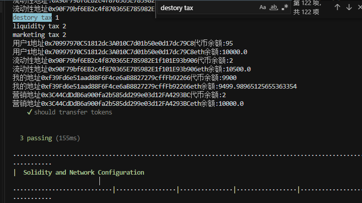
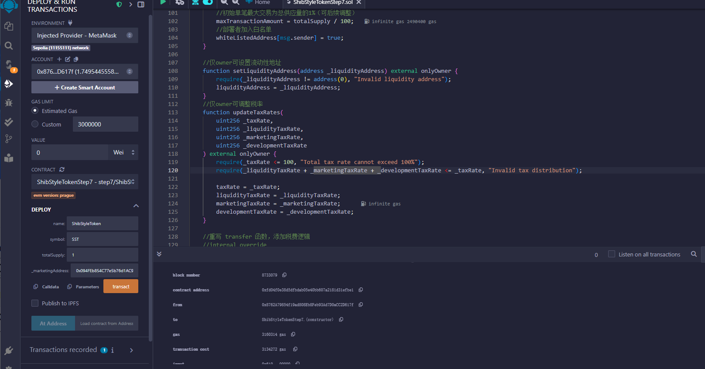

[基础业务知识](README2.md)
# 准备工作
## 环境搭建
- 安装 VSCode + Solidity 插件
- 安装 Hardhat
```javascript
    npm init -y && npm install --save-dev hardhat
```
- 新建项目目录shibi，使用vscode打开目录，命令行执行命令初始化一个hardhat项目
 ```javascript
    npx hardhat init
```
- 安装 OpenZeppelin 库（安全的合约基础）
```javascript
   npm install @openzeppelin/contracts
```
# 开发步骤
## 步骤1：实现基础 ERC20 代币功能
先搭建最基础的 ERC20 代币框架，确保代币的发行、转账等核心功能可用。
```javascript
   contracts\step1\ShibStyleTokenStep1
```
## 步骤2：添加代币税机制
在基础代币上增加交易税功能，对每笔交易抽税并分配到指定地址（如流动性池、营销钱包）。
```javascript
   contracts\step2\ShibStyleTokenStep2
```

## 步骤 3：添加交易限制功能
防止大额交易操纵市场，设置单笔最大额度和每日交易次数限制。
```javascript
   contracts\step3\ShibStyleTokenStep3
```

## 步骤 4：集成流动性池交互
支持用户向流动性池添加 / 移除流动性（与 DEX 的核心交互）。防止大额交易操纵市场，设置单笔最大额度和每日交易次数限制。
```javascript
   contracts\step4\ShibStyleTokenStep4
```

## 步骤 5 编写测试用例
```javascript
   contracts\test\Lock.js
```

## 步骤 6 运行测试用例npx hardhat test，截图如下



## 步骤 7 集成uniswap的添加和移除流动性
删除合约中的流动性相关代码，并改造部分代码
```javascript
   contracts\step7\ShibStyleTokenStep7
```
## 步骤 8 部署合约到remix到Sepolia测试网并获得合约地址
 - 本地全局安装remix ：  npm install -g @remix-project/remixd  如果报错先尝试npm cache clean --force

 - 安装成功后运行：npx remixd （注意先进入contracts目录，这样才会只同步这个目录）
 - 开始在remix部署，获取到合约地址：0x0f000aa0106e3281d553b37ffd99d35225184bd1  部署如图
  

  ## 步骤 9 根据合约地址到remix到https://app.uniswap.org/添加流动性池子
